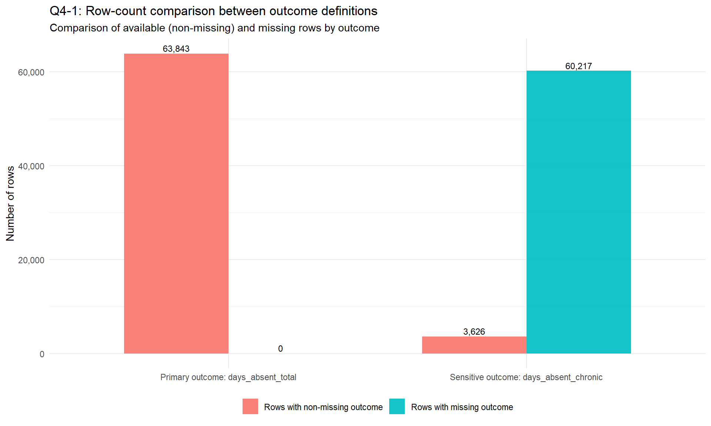

{fig-alt="EDA-3 outcome comparison" width="90%"}

*Figure: Primary EDA-3 comparison output highlighting outcome-definition coverage from `analysis/eda-3/eda-3.qmd`.*

Welcome to the Frontend 22 developer briefing for **Absent from Chronic**. This site packages the project context and the newly completed EDA-3 work into a navigable technical snapshot for collaborators who need to move from results to implementation quickly.

The **Project** section captures mission, method, glossary, and a concise synthesis of where EDA-3 fits. The **Pipeline** section explains the Ferry/Ellis flow and the current cache definition. The **Analysis** section links to the rendered EDA and provides a practical findings brief derived from EDA-3 outputs. The **Docs** section contains adapted repository documentation, site provenance, and publishing architecture notes.

This frontend is grounded in:

- `analysis/frontend-22/initial.prompt.md` (audience/tone intent)
- `README.md` and `ai/project/mission.md` (project context)
- `analysis/eda-3/eda-3.qmd` (EDA-3 analytic evidence)
- `manipulation/pipeline.md` (pipeline structure)

## Pipeline


